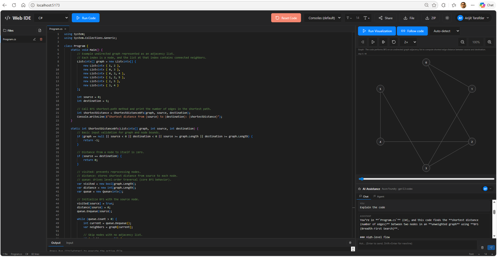

# Web IDE

A browser-based IDE built with React + Vite + Monaco Editor. Supports 15 languages with syntax highlighting and remote code execution via the [Piston](https://github.com/engineer-man/piston) public API.

## Demo

[](https://raw.githubusercontent.com/arijitt/CodeScope/main/CodeScope-Demo.mp4)

<!--
  GitHub's blob viewer refuses to render mp4 files inline (returns
  "Sorry about that, but we can't show files that are this big right now."
  even for small files). Pointing the <video> tag at the
  raw.githubusercontent.com CDN streams the bytes directly to the
  browser's native player and avoids that error.
-->

<p align="center" width="100%">
  <video src="https://raw.githubusercontent.com/arijitt/CodeScope/main/CodeScope-Demo.mp4" poster="./CodeScope-Thumbnail.png" width="80%" controls>
    Your browser doesn't support inline video playback.
    <a href="https://raw.githubusercontent.com/arijitt/CodeScope/main/CodeScope-Demo.mp4">Download the demo video</a>.
  </video>
</p>

## Features

- 🎨 **Monaco Editor** — VS Code's editor with full syntax highlighting
- 🌐 **15 languages**: JavaScript, TypeScript, Python, Java, C++, C#, Go, Rust, Ruby, PHP, HTML, CSS, JSON, Markdown, SQL
- ▶️ **Run code** via Wandbox API (no API key required)
- 📥 **Stdin tab** in the Output panel — feed standard input to your program
- 📁 **File tree** with create/rename/delete
- 📑 **Tabs** for multiple open files
- 🪟 **Multi-pane layout** — Files (left) · Editor + Output (center) · Run Visualization + AI Assistance (right)
- ↔️ **Draggable resizers** on every pane (double-click any divider to reset)
- 🤖 **AI Assistance** pane — chat with **Azure AI Foundry** using your own Azure identity (no API key); falls back to OpenAI when a key is provided
- 🌗 **Light / dark themes**
- 💾 **Autosave** to `localStorage`
- ⬇️ **Download** active file or whole workspace as ZIP
- 🔗 **Share via URL** (workspace compressed into the URL)
- ⌨️ **Shortcuts**: `Ctrl+Enter` to run, `Ctrl+S` no-op (autosave)

## Getting started

```bash
npm install
npm run dev
```

Open http://localhost:5173.

## Build

```bash
npm run build
npm run preview
```

## Code execution backend (Wandbox)

The Run button uses the free public **[Wandbox](https://wandbox.org/)** API — no setup, no API key, CORS-enabled. All 11 runnable languages are supported (HTML/CSS/JSON/Markdown are editor-only).

To use a different Wandbox instance, set `VITE_WANDBOX_URL` in `.env`:

```
VITE_WANDBOX_URL=https://wandbox.org/api
```

A legacy Piston client is still in `src/lib/piston.ts` if you'd rather self-host a Piston server. Note: the public emkc.org Piston API became whitelist-only on 2026-02-15.

## AI Assistance pane

The right-side **AI Assistance** pane has two providers, picked automatically:

| # | Provider | When it's used | What you need |
|---|----------|----------------|---------------|
| 1 | **Azure AI Foundry** *(preferred)* | Whenever you're signed in to Azure on this machine | `az login` (or any [`DefaultAzureCredential`](https://learn.microsoft.com/azure/developer/javascript/sdk/credential-chains#use-defaultazurecredential-for-flexibility) source: VS Code Azure, Managed Identity, `AZURE_*` env vars) |
| 2 | **OpenAI** *(fallback)* | When no Azure credential is available | `VITE_OPENAI_API_KEY` set in `.env` |

The current provider is shown next to the AI panel header along with an **account chip** (also visible in the top toolbar). Click it to refresh credentials, sign out, or read instructions when not signed in.

### Azure AI Foundry sign-in

Foundry is called using **your own** AAD bearer token — no API key, no app registration on the SPA.

1. Sign in once in your terminal:
   ```bash
   az login --tenant common
   ```
2. `npm run dev` — startup logs `[auth-broker] ready (account: <your-upn>)`.
3. Open the IDE; the AI panel header shows your UPN and `Azure Foundry · gpt-5.3-codex`. Type a prompt — it's calling your Foundry endpoint.

Configure the endpoint and deployment in `.env`:
```
VITE_FOUNDRY_ENDPOINT=https://defaultfoundryresource.cognitiveservices.azure.com/openai/responses?api-version=2025-04-01-preview
VITE_FOUNDRY_DEPLOYMENT=gpt-5.3-codex
```

#### How it works
`DefaultAzureCredential` is Node-only — it cannot run in a browser. To use it without an SPA app registration / MSAL.js, the Vite dev server runs a tiny **localhost-only auth broker** (`server/auth-broker.ts`) that mints the bearer in the same Node process and serves it to the SPA at `/auth/token`. Tokens are kept in process memory only and never written to disk. The broker rejects any request not coming from `127.0.0.1` / `::1`.

> 🛑 **Production warning** — this dev broker is for local development only. Any process on your machine that can reach `localhost:5173` can read your Azure token. **Do not deploy it.** For production, replace the broker with a real backend that holds the credential server-side and proxies Foundry calls (the SPA never sees a bearer).

To disable Foundry locally (e.g., when offline) and force the OpenAI fallback:
```
VITE_DISABLE_FOUNDRY=1
```

### OpenAI fallback

1. Copy `.env.example` to `.env`
2. Set `VITE_OPENAI_API_KEY=sk-...`
3. Restart `npm run dev`

Press **Enter** to send, **Shift+Enter** for a newline.

> ⚠️ **OpenAI key warning** — Vite bundles `VITE_`-prefixed variables into the client. Anyone who loads the page can read your key. Use only for local / personal development. For production, proxy AI calls through a backend you control.

## Coding agent (litecode-style)

The AI Assistance pane has two tabs: **Chat** (single-file Q&A) and **Agent**. The Agent tab turns
the IDE into a multi-file coding harness modeled on
[razvanneculai/litecode](https://github.com/razvanneculai/litecode).

**How it works**

1. **Planner** — one LLM call. Given your plain-English request + a context map of the
   workspace + short-term memory, it returns a JSON list of tasks
   (`{path, op, hint, deps}`).
2. **Orchestrator** — pure TS. Topologically sorts the tasks, groups them into parallel waves,
   and calls the executor for each task. Concurrency cap (default 6, override with
   `VITE_AGENT_MAX_CONCURRENCY`).
3. **Executor** — one LLM call per file. Receives just that file's contents (or a section of
   it via the file's analysis index when the file is too large for the budget) and returns
   the new full content.
4. **Diff preview** — every proposed edit is shown in a modal with red/green hunks. You pick
   which to **Apply** or **Reject** before anything touches the workspace.
5. **Memory** — after at least one edit is applied, a one-sentence synthesis of what changed is
   pushed into a ring buffer of the last 4 actions (persisted to `localStorage` under
   `web-ide.agent.memory.v1`). The next planner call sees this memory, so phrases like
   "undo the last change" or "also add a goodbye() function" work as expected.

**Token budget**

Every LLM call is capped at 8192 tokens, enforced in code before each call:

```
Total context window:  8192
System prompt:        ~1000
Reserved reply:        2000
Memory (≤ 4 entries): ~360
Available for code:  ~4800
```

Priority drops when the prompt is over budget: folder context first, then memory, then the
executor falls back to loading just a section of the file via its line-range analysis index.
This matches litecode's `canFit` logic.

**Providers**

Same as Chat — Azure AI Foundry (preferred when `az login`'d) → OpenAI key fallback. Both
planner and executor calls reuse the existing provider router.

**Tips**

- The agent shines on cross-file refactors: "rename `validateToken` to `verifyToken` everywhere",
  "extract `formatDate` from `utils.ts` into a new `dateFormat.ts`", "add JSDoc to every
  exported function in `src/lib/`".
- Use **Ctrl+Enter** in the Agent input to start a run.
- Click **Cancel** to abort an in-flight planner or executor call (uses `AbortController`).
- Clear memory from the chip at the top of the Agent tab when you want a clean slate.

## Run visualization

The right-side **Run Visualization** pane animates how the active file's algorithm
executes step-by-step, on a sample input the IDE generates for you.

How it works:

1. Click **Visualize** in the Run Visualization pane header.
2. The IDE asks the AI provider (Foundry → OpenAI fallback) to:
   - **Classify** the algorithm into one of seven categories (graph, tree,
     array sort, grid, linked list, recursion call tree, stack/queue),
   - **Generate** a small sample input,
   - **Rewrite** the source so each interesting step prints a probe line
     of the form `__VIZ__:{json}`.
3. Wandbox runs the instrumented code; the runner parses the probe lines
   into a typed event stream.
4. If instrumentation fails (compile error, no probes emitted, etc.) the
   IDE falls back to an **LLM-simulated trace** and shows a yellow
   **Simulated** badge so you know it isn't real execution.
5. The animator replays the events into one of seven hand-rolled SVG
   renderers; transport controls (▶ ⏸ ⏮ ⏭ Reset, speed selector, scrubber)
   let you step through frame-by-frame.

Manual override:

- The **Auto-detect** dropdown next to the Visualize button lets you force
  a specific category (e.g., choose "Graph" if the planner picked "Tree").
  Clicking Visualize again re-plans with that category locked in.

Limits:

- Hard cap of 500 step events by default — set `VITE_VIZ_MAX_STEPS` in
  `.env.local` to raise it (clamped to [1, 5000]). Truncated traces show
  a "truncated" warning in the status row.
- All renderers are hand-rolled SVG; no extra runtime dependency.
- The Visualize button is disabled until you have an open file.

### Bidirectional cursor binding

The visualization is wired to the editor cursor in both directions, so the
animation never feels detached from the source code:

- **Cursor → viz**: click anywhere in the editor (or use arrow keys) and
  the visualization seeks to the state *after the last event with
  `event.line ≤ cursor.line`*. Lines without events keep showing the
  most recent state — scrubbing the cursor downward feels like a smooth
  scrub through execution.
- **Viz → cursor**: clicking ▶ or ⏭ moves the cursor to the line of the
  current step and reveals it in the centre of the editor if it's off-
  screen. The executing line gets a tinted background and a small marker
  in the gutter.

Use the **Follow code** toggle in the viz toolbar (link icon, ON by
default) to disable both directions if you'd rather scrub the trace
without your cursor jumping around.

If you edit the file after visualizing, line numbers may drift out of
sync. The pane shows a yellow **"Code modified — re-Visualize for
accuracy"** banner with a one-click re-plan action; the existing mapping
keeps working in the meantime (it's just approximate).

Line tags are best-effort: the planner is asked to attach a `"line"` field
to every probe pointing at the user's *original* source line. Older traces
generated before this feature, or events the planner couldn't tag, simply
no-op for the cursor binding without breaking the rest of the playback.

## Layout

```
Toolbar
─────────────────────────────────────────────────────
Sidebar │  TabBar / Editor          │  Run Viz (75%)
        │  ──────────────           │  ─────────────
        │  Output / Input  (tabs)   │  AI Assist (25%)
─────────────────────────────────────────────────────
StatusBar
```

All four interior dividers are draggable; double-click any divider to reset to its default size.

## Notes

- Share URLs are capped at ~6 KB. Download the ZIP for larger workspaces.
- Monaco assets load from a CDN to keep the bundle small.
- Languages without a Piston runtime (HTML/CSS/JSON/Markdown) are editor-only.
